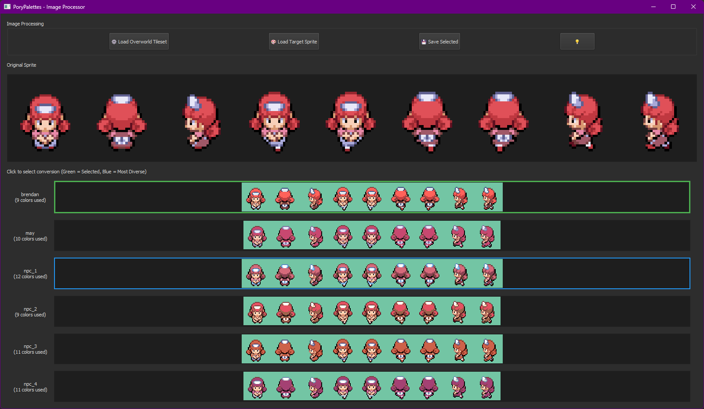

# Porypal

Porypal is a specialized tool for converting sprites into Gen 3-compatible 16-color palettes sprites, designed for Pokémon ROM hacking and decompilation (pokeemerald/pokefirered). It's originally made to automate overworld sprites injection, but can be used for other graphics modifications.



## Features

- Gen 3-Compatible Tilesheet Conversion: Automatically converts .PNG sprites into tilesheets with 16-color palettes suitable for use in Pokémon ROMs (such as Pokémon FireRed and Pokémon Emerald).
- Color Replacement: Utilizes the in-game palettes for consistent sprite coloring and tilesheet creation.
- Batch Sprite Replacement (TODO): Automates the process of replacing overworld sprites in the graphics/object_events/pics/people folder of your Pokémon ROM.
- Customizable Configuration: Allows customization via a config.yaml file to tailor the behavior of the tool to your specific needs.

## Installation

### Prerequisites
Ensure you have Python 3.6+ installed on your system. You can download Python from the [official website](https://www.python.org/downloads/).

### 1. Clone the repository or download the code
Download the repository to your local machine or clone it using Git:

<details>
    <summary><i>I recommend cloning the project inside your pokefirered/pokeemerald's `tools` folder:</i></summary>

>   porypal's key functionality is to automatically replace gba tilesets inside the `graphics/object_events/pics/people` folder. Placing it in the `tools` directory facilitates the path automation for the batch replacement feature.
> 
</details>

```bash
git clone https://github.com/Loxed/porypal.git
```

### 2. Install dependencies

#### Windows
1. Open Command Prompt (`cmd`) or PowerShell.
2. Navigate to the project directory:

   ```bash
   cd \path\to\decomp\tools\porypal
   ```

3. Install the required dependencies using `pip`:

   ```bash
   pip install -r requirements.txt
   ```

#### macOS / Linux
1. Open Terminal.
2. Navigate to the project directory:

   ```bash
   cd /path/to/decomp/tools/porypal
   ```

3. Run the installer:
    ```bash
    ./setup.sh
    ```

### 3. Run the application

After installing the dependencies, you can run the `main.py` script.

```bash
python3 main.py
```

## Directory Structure

```
porypal/
│
├── example/            # Example data or files
├── palettes/           # Palette files, containing .pal files
├── config.yaml         # Configuration file
├── LICENSE             # MIT License file
├── main.py             # Main script
├── requirements.txt    # Python Dependencies
├── setup.sh            # MacOS/Linux install script
```

## License
This project is licensed under the MIT License - see the [LICENSE](LICENSE) file for details.

## Contact
For questions or support, reach out to `prison_lox` on Discord.