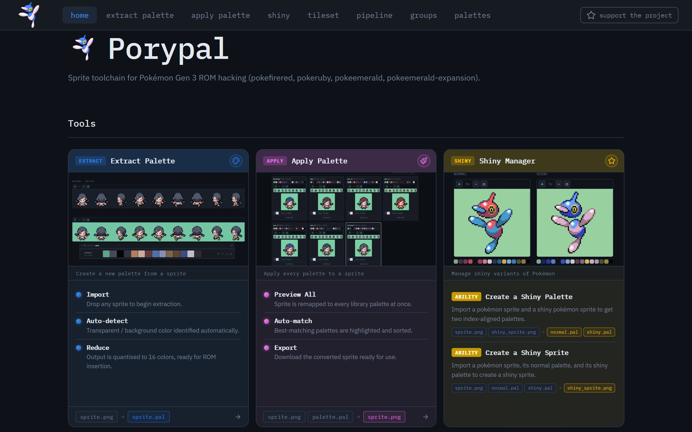
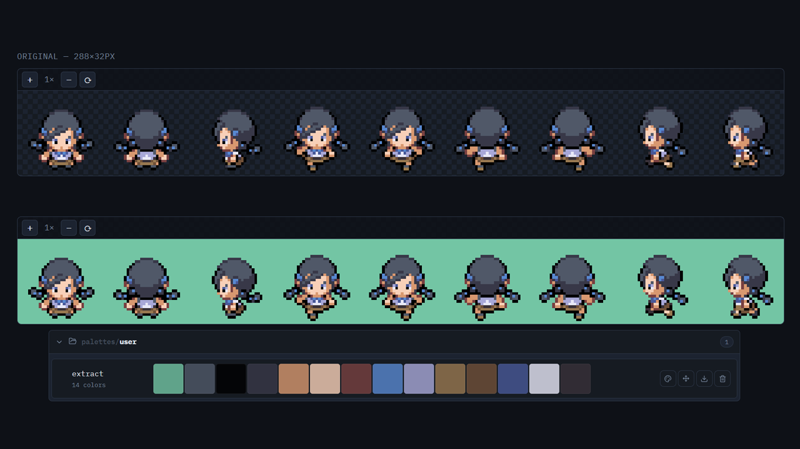
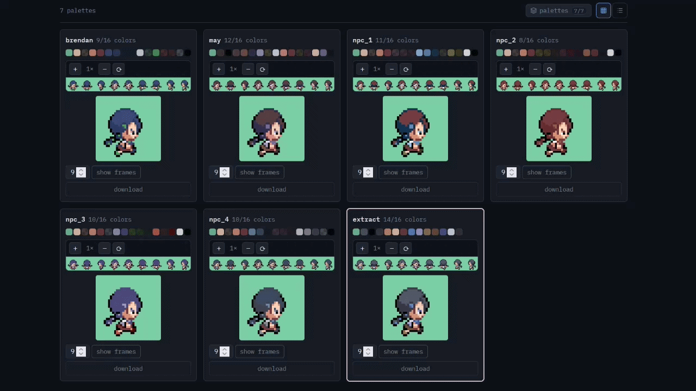
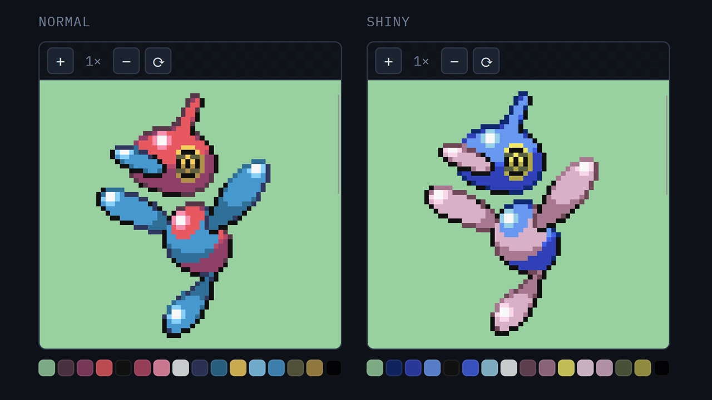
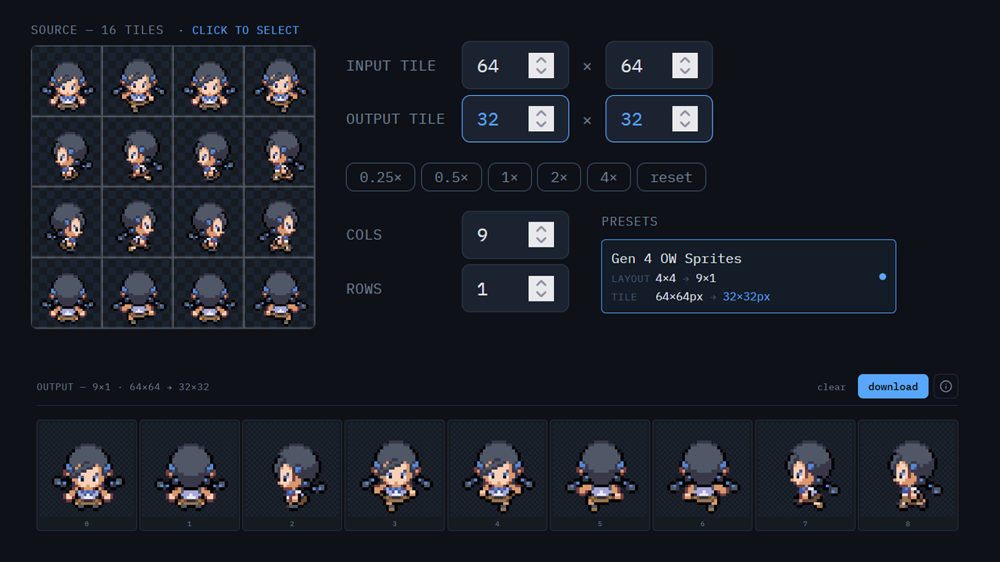
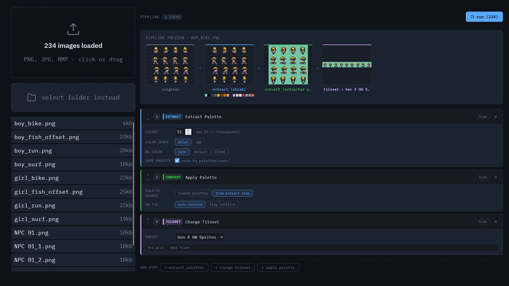
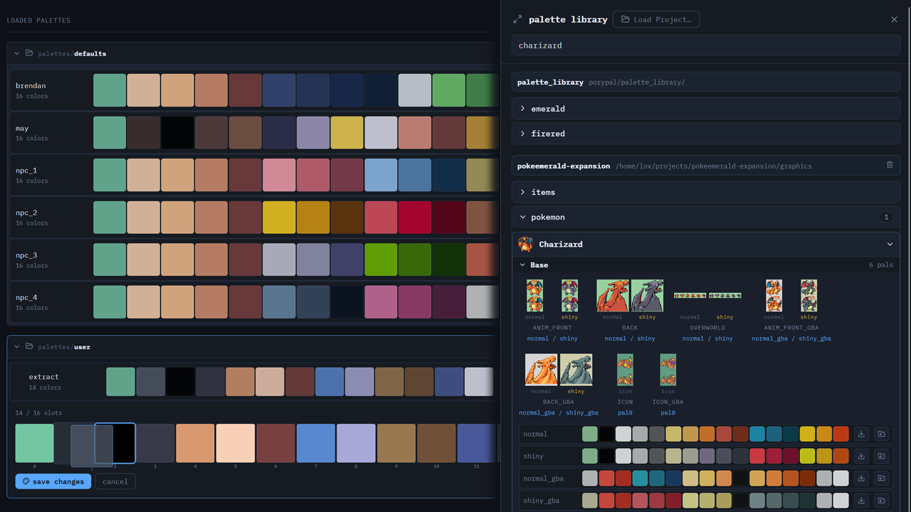
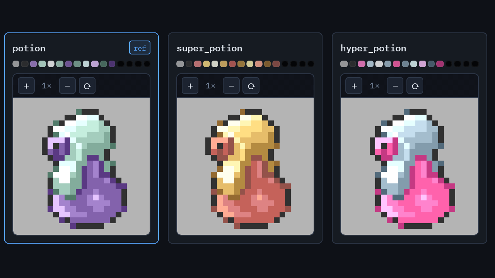

#  Porypal

Porypal is a sprite tool for Pokémon Gen 3 ROM hacking (pokeemerald, pokefirered, pokeemerald-expansion).



#### Why do I need it?

The GBA can only display 16 colors per sprite. This is a hardware limitation, not 16 colors total, but 16 per palette, and every sprite has to use exactly one.

This means you can't just export a PNG from your art program and drop it into the game. Your sprite needs two things first:

1. A palette: a `.pal` file listing the 16 colors your sprite is allowed to use
2. A converted sprite: every pixel remapped to the nearest color in that palette

Porypal handles both.

## What can Porypal do for me?

**Extract Palette**

- Import a sprite to extract a palette (`sprite.pal`) from it.
- Automatically detects the sprite's transparent/background color.
- Reduces the sprite's colors down to 16, so it's ready for insertion.

**Apply Palette**

- Import a sprite to see it converted against every palette in your library at once.
- The best-matching palettes are automatically highlighted and applied.
- Download the converted `sprite.png`, ready for use with the selected palette.

**Shiny**

1. *Create a Shiny Palette*
   - Import `sprite.png` + `shiny_sprite.png` to get two index-aligned palettes (`normal.pal` and `shiny.pal`).
2. *Create a Shiny Sprite*
   - Import `sprite.png` + `normal.pal` + `shiny.pal` to get a `shiny_sprite.png`.

**Tileset**

- Slice a spritesheet into tiles and rearrange them into any layout you want.
- Save layouts as presets and reuse them across spritesheets of the same dimensions.

**Pipeline**

- Build a multi-step pipeline (Extract Palette, Apply Tileset, Apply Palette) and run it across an entire folder.
- Results download as a zip with a per-file summary.

**Palettes**

- Manage the palettes available across the app in one place.
- Upload your own `.pal` files or import palettes from the built-in library, organised by game and category.

**Group Operations**


1. *Group Extract*
   - Import multiple sprites (Pokeballs, Z-Crystals, Mega Stones) and automatically group them by silhouette (same shape = same group).
   - Within each group, colors that appear across most sprites are locked to the same palette slot index, so swapping palettes in-game works more smoothly.
2. *Variants*
   - For sprites that share the same pixel art but use different palettes in-game (e.g., Potion, Super Potion, Hyper Potion), import all the recolored versions and define one as the reference.
   - Produces one index-aligned palette per sprite (`potion.pal`, `super_potion.pal`, `hyper_potion.pal`).

## Getting Started

### Prerequisites

| Tool | Minimum version | Download |
|------|----------------|---------|
| Python | 3.10+ | https://python.org |
| Node.js | 18+ | https://nodejs.org |
| Git | any | https://git-scm.com |

### Install

**Linux / macOS**
```bash
git clone https://github.com/Loxed/porypal.git
cd porypal
chmod +x scripts/setup.sh scripts/run.sh
./scripts/setup.sh
```

**Windows (PowerShell)**
```powershell
git clone https://github.com/Loxed/porypal.git
cd porypal
Set-ExecutionPolicy -Scope Process -ExecutionPolicy Bypass
.\scripts\setup.ps1
```

Setup installs Python dependencies, builds the frontend, and creates the required folders. It only needs to be run once.

### Run

**Linux / macOS / WSL**
```bash
./scripts/run.sh
```

**Windows**
```powershell
.\venv\Scripts\Activate.ps1
python main.py
```

Then open **http://127.0.0.1:7860** in your browser. The browser opens automatically.

> **WSL users:** the browser won't open automatically. Run `./scripts/run.sh` and open http://127.0.0.1:7860 in your Windows browser manually.

```
python main.py --port 8080       # use a different port
python main.py --no-browser      # don't open the browser automatically
```

### Update

```bash
git pull
./scripts/setup.sh
```

## Directory Structure

```
porypal/
├── docs/             # Documentation and testing notes
├── frontend/         # React + Vite web UI
├── model/            # Pure Python -- palette, image, and tileset logic
├── palettes/
│   ├── defaults/     # Read-only shipped palettes
│   └── user/         # Your palettes (managed from the UI)
├── palette_library/  # Browseable library, organised by game/category
├── presets/          # Saved tileset layout presets (JSON)
├── scripts/
│   ├── run.sh        # Launch the app (Linux/macOS/WSL)
│   ├── setup.sh      # One-time setup (Linux/macOS/WSL)
│   └── setup.ps1     # One-time setup (Windows)
├── server/           # FastAPI backend
│   └── api/          # One file per feature
├── tests/            # pytest test suite
├── LICENSE
├── main.py           # Entry point -- starts the server
├── readme.md
└── requirements.txt
```

## License

This project is licensed under the GNU General Public License -- see the [LICENSE](LICENSE) file for details.

## Contact

For questions or support, reach out to `prison_lox` on Discord.

## Credits

Example sprites used in the tileset editor come from:
- [Gen 5 Characters in Gen 4 OW style 2.0](https://web.archive.org/web/20231001155146/https://reliccastle.com/resources/370/) by DiegoWT and UltimoSpriter
- [ALL Official Gen 4 Overworld Sprites v1.5](https://eeveeexpo.com/resources/404/) by VanillaSunshine
